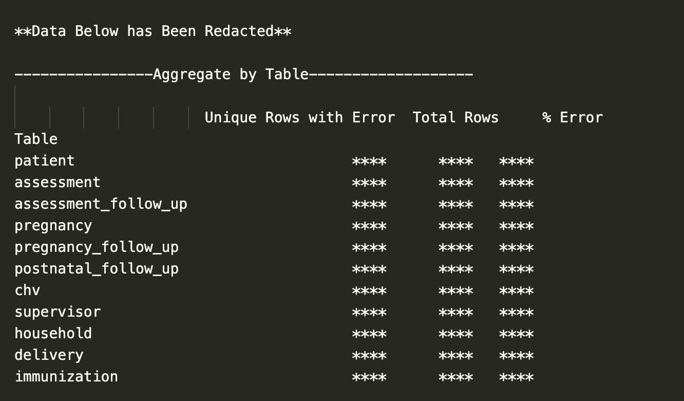
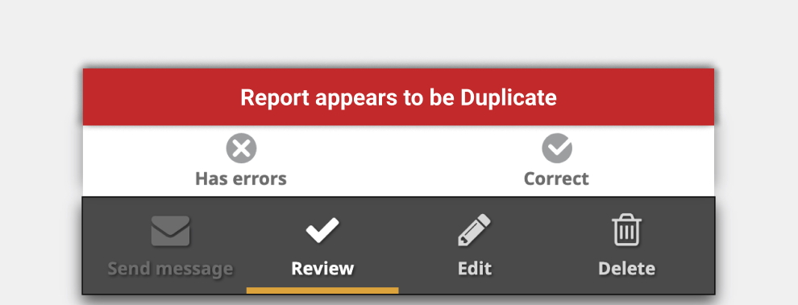
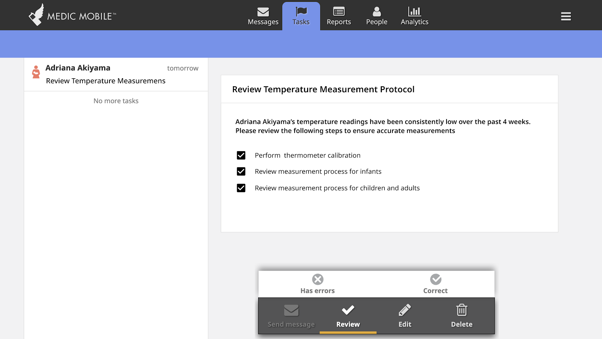
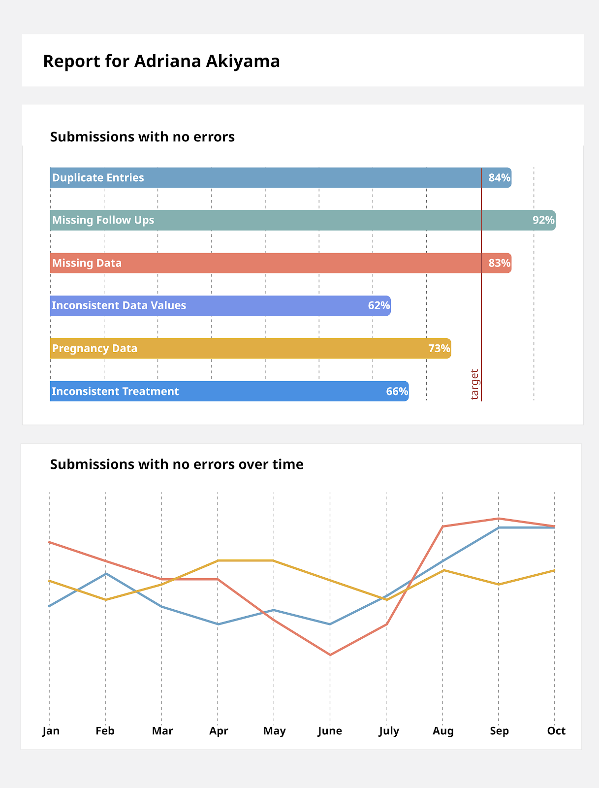

# How should I visualize this data?
The output from the IoP pipeline contains a lot of information on all of the tests, and developing meaningful analytics and visualizations will help make sense of the problems. However, there are many different kinds of IoP errors, ranging from simple missing fields to errors that indicate a deeper underlying problem. Determining which IoP errors are important and how they should be addressed requires a range of expertise, which the DataKind team does not have. So, instead of making a one-size-fits-all dashboard, we are sharing our thinking about different categories of data or UI visualizations that can hopefully help you decide how you might take actions based on different tests and who you might involve.

## Database-wide reports
The data visualization that we are providing out of the box are two kinds of reports 

- A test coverage report with the number of failing entries for each test, plus aggregation up to the number of unique rows failing one or more tests for each table.

- A time series plot of the % of entries in a given table that failed a test per week.

>>REDACTED

These reports are going to be most useful for Medic Mobile product teams, program managers and anyone else who sits at a site installation level or higher. These reports are good for catching large problems that can be solved by updating the backend or client UX. Some examples from the current set of tests include:

**Example Test - Date of birth and registration date alignment**

>>REDACTED

Looking at the reports for the DOB and registration alignment test shows that over 58% of entries in the database have this IoP problem. Plotting the fraction of entries that fail this test (above) shows that while there appears to be some improvement, the error occurs consistently over the length of the program. This suggests that the problem will require a system-level intervention. In this case, it seems likely that many CHVs are only entering a patient’s age, and not full date of birth, though it would take further investigation to figure out if it can be corrected with training or UX interventions.

## Form level interventions

Some IoP occurs at relatively low frequency and is the result of simple errors. Rather than just tagging and quantifying data as IoP, the system can flag the error for human intervention. In this case, the output is less “data visualization” and more about UI interventions

**Example - Duplicate Forms**

One common category of IoP we tested for are duplicate forms. Some forms are submitted for the same patient in the same category within an improbably short time frame, sometimes with conflicting information. One way to address this is to highlight the error in the Medic Mobile app for the CHV to review their entries and select the correct information. This way users are guided to correct and maintain data cleanliness without needing to make assumptions or ignore data on the back end.

## CHV level review

IoP flags can also be aggregated at the CHV level to spot trends where a CHV might have a consistent problem. Some IoP tests can only be performed at a CHV level, because they are tests on the statistical distribution of data, not on an individual data point itself.

For problems that occur at the CHV level, there are potentially many different ways to visualize and act on this information, though they will likely fall in the “intervention” mode rather than the “dashboard” mode.

**Example - Temperature measurements**

When a CHV takes a temperature reading as part of an assessment, the software already limits the input to be between 34C and 40C. This is a reasonable range of body temperatures, so it would be difficult to point to any individual temperature reading as being incorrect. However, a CHV takes many temperature readings across many assessments, so we can check if the mean temperature measured by an individual CHV is close to the mean temperature measured by all CHVs. There is an IoP test that flags CHVs who have a mean temperature that differs from the global mean in a statistically significant way. 

Of course, there are many possible reasons why a CHV could have a different distribution (such as a higher than normal prevalence of infectious disease in an area), so it’s important to not outright assign blame. An appropriate intervention might be to add a task to the supervisor’s task list to review a CHV’s thermometer and measurement procedure.

**Example - Dashboard**

**FAKE DATE** 

Aggregating data for a CHV, supervisor or entire program would allow whoever is responsible for administration to set individual data cleanliness goals that are appropriate for the specific context. However, as we’ve demonstrated above, there are many possible causes for IoP data so it should be important to not place unrealistic expectations on meeting metrics, as it might have unintended consequences, including a decrease in data accuracy (e.g. someone entering fictitious data in order to avoid a missing data field)

